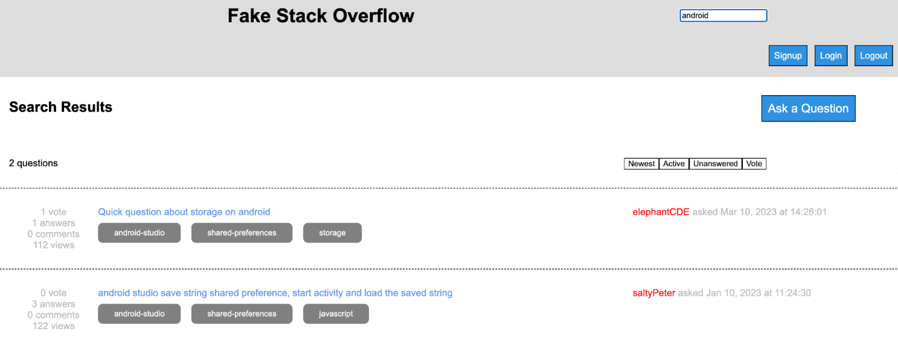
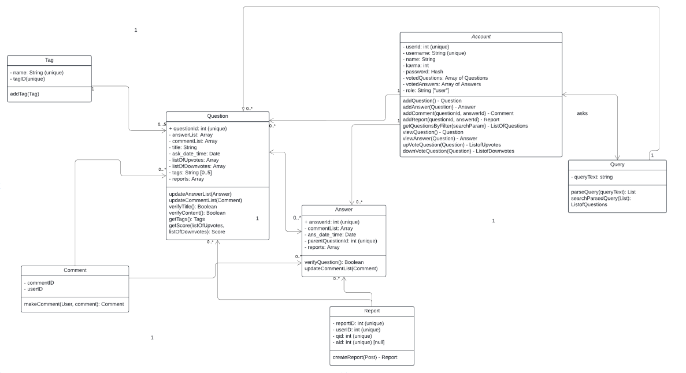

# Mock Overflow

This was a project done in collaboration with Kyra Riedal. In this project, we implemented a Mock Overflow platform where users similar to Stack Overflow, can post questions and answers, vote on posts, vote on questions, and many more features. 



## Software and Architecture

This UML Diagram represents our code and the software used to implement each feature of our code. 



## Security Mechanisms

1. **Question tampering:** By using an account service and requiring users to log in to use the program, it ensures that nobody except the post owner can tamper with a post. 
2. **Account spoofing:** By hashing a password, we can ensure that when a password is saved to the system, it is encrypted. Furthermore, when logging in, a unique identifier is attached to the account to ensure that nobody else can sniff account information and it ensures that the current instance is the only one logged in. 

## Development Process

An agile development workflow was used to accommodate frequent changes that may be required by the users. This supports the idea of informal reviews, which reduce bugs during testing. It also encourages refactoring to improve code structure where future changes will be easier to implement. 

## Usage

1. Installing dependencies: Make sure Node.js is installed and MongoDB. 

  In the root directory: 
  ```
  $ cd client/
  $ npm install
  $ cd server/
  $ npm install
  ```
  In the server directory: 
  ```
  $ cd server/
  $ npm install express
  $ npm install mongoose
  $ npm install -g nodemon
  ```
2. Starting the server: Make sure that MongoDB is running through the cmd. By default, MongoDB will run on 127.0.0.1, port 27017. Remember to configure populate_db.js to ensure that it is properly connected to mongoose. 

  Populate the database from the root: 
  ```
  $ node server/populate_db.js
  ```

  Starting the program from the root: 
  ```
  $ npm start
  ```

## Conclusion

In conclusion, the Mock Overflow project successfully implemented a platform where users can interact by posting questions and answers, voting, and more. By adopting an agile development workflow, we were able to work autonomously while also coming together to resolve any issues that emerged during the development process. This approach allowed us to sharpen our skills in writing clean, readable code, ensuring efficient communication is shared between us. 

Beyond the core functionality, the focus on security has changed the way we approach development. It has taught us to consider not just the functionality of the program but how it performs in the face of potential threats. This form of security-driven development required us to identify vulnerabilities that in other projects, we may not have thought of. Furthermore, the implementation of security allowed us to design with long-term sustainability and scalability in mind, ensuring that we develop to be resilient to evolving cyber threats. 

Overall, our work with Mock Overflow allowed us to learn a lot more about development where some projects don't. By prioritizing both autonomous development and collaborative reviews through the agile development method, we were able to create a simple platform that was both functional and secure. This allowed us to contribute our unique skills and come together to solve challenges as a team. In the future, we hope to include more features, while cleaning up old ones, and to include a more modern UI into our platform. 
